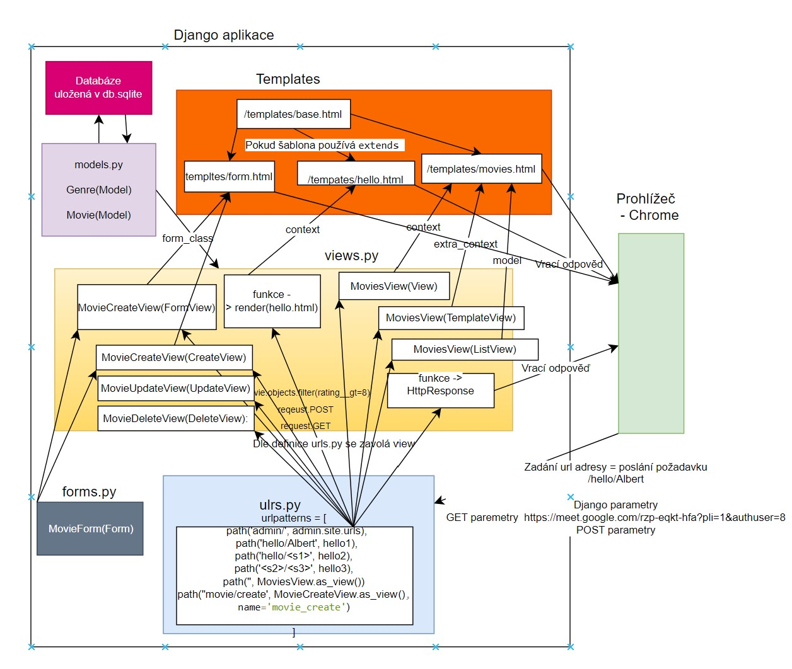

##
v Adminovi je uživatelské jméno "1234" a heslo "1234"

## Užitečné příkazy
`python -m pip install django==4.1.1`

`django-admin startproject SDAcia .`

`python3 manage.py runserver` - spuštění serveru

`python3 manage.py startapp viewer` - přidání aplikace

`python3 manage.py makemigrations` - vytvoření migrací

`python3 manage.py migrate` - aplikování migrací

`python3 manage.py shell`

`python manage.py createsuperuser` - vytvoření uživatele pro admin rozhraní

[Dokumentace QuerySet](https://docs.djangoproject.com/en/5.1/ref/models/querysets/)

# Přehled naší django aplikace

## Musím umět

- Stáhnout Python, nainstalovat django
- Vytvořit django projekt, vytvořit django applikaci
- Vytvořit ORM model ( **class Movie(Model): **)
- Vytvořit a aplikovat migraci databáze/modelu
- Přidat objekt do DB
- Upravit objekt v DB
- Smazat objekt v DB
- Vytvořit url v djangu
- Vrátit html šablonu naplněnou daty
- Dědění html šablony
- Filtrování objektů z DB, získání jednoho konkrétního objektu
- Odeslat formulář
- Vytvořit formulář pomocí třídy

## Tipy
- id/primární klíč konkrétního záznamu získám jako **car.pk**
- nalezení tohoto záznamu pak mohu udělat jako **Car.objects.get(pk=car_pk)**

# TASK na 9.9.2024:
- Udělat přihlašování a odhlašování [urls.py](https://github.com/alifuk/CZ21_Movies/blob/master/hollymovies/urls.py) řádky login a logout (nezapomenout importy)
- Udělat šablonu přihlašování [viewer/templates/registration/login.html](https://github.com/alifuk/CZ21_Movies/blob/master/viewer/templates/registration/login.html)
- Do SETTINGs nastavit (LOGIN_REDIRECT_URL a LOGOUT_REDIRECT_URL)(https://github.com/alifuk/CZ21_Movies/blob/master/hollymovies/settings.py) 
- Dát nějaké views za dekorátor `@login_required` či `LoginRequiredMixin` pokud se jedná o třídu - viz prezentace

# TASK na 10.9.2024:
- Pokud nemám TASK na 9.9.2024, tak udělat ten
- Udělat registraci, změnu hesla viz. urls.py, views.py, forms.py

